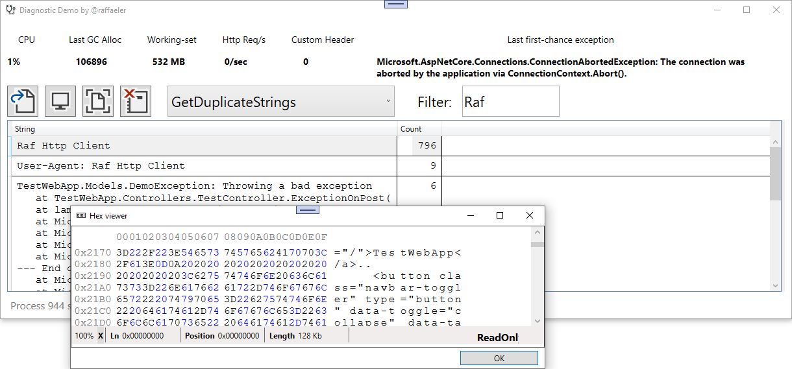

# Power Diagnostics
The code in this repository is part of the demos I use in my talks about advanced diagnostics in .NET.
The main idea is to explain how to **automate** the diagnostics using a side process that monitors an application running in production and, under certain triggers, takes a snapshot and understand what's going wrong.

While classic debuggers are powerful general-purpose diagnostic tools, writing an application-specific tool is even more powerful because it knows what to monitor and how objects are shaped. This translates in more specific and more helpful information.

The code in this repository **does not implement any automated task**, but instead shows with a WPF UI, how the building blocks work so that anyone can write a tailor-made automation for their applications.

---
## Main dependencies

Experiments in .NET Core diagnostics using:
- [ClrMD](https://github.com/microsoft/clrmd). This Microsoft library contains the code equivalent to the "SOS" plugin used in WinDbg. This code is cross-platform and allows investigating on the application objects as well as the runtime.
- [DiagnosticClient](https://github.com/dotnet/diagnostics/tree/master/src/Microsoft.Diagnostics.NETCore.Client). This Microsoft library is new in .NET Core 3 and opens a special communication channel with the CLR of any .NET Core powered application. It uses named pipes and is used in many dotnet diagnostics global tools
- [Trace Event library](https://github.com/microsoft/perfview/blob/master/documentation/TraceEvent/TraceEventLibrary.md). The Microsoft Trace Event Library (kinda ETW but cross-platform) allows retrieving important information about any .NET process such as memory (GC and working set), HTTP requests, CPU, custom traces, and many, many others.
- [WpfHexEditorControl](https://github.com/abbaye/WpfHexEditorControl/) Thanks to Derek for the great work! This is the hexadecimal viewer control used to view the memory in the WPF demo app.

---
## Projects description
The projects in the solution are:
- ClrDiagnostics. This project contains wrappers around CLRMD and DiagnosticClient. The most important parts are the extensions I made to CLRMD to better support Linq-style queries on all the objects exposed by CLRMD. It also includes several queries that I named using the SOS commands. Their output is almost the same of what you would obtain from SOS
  - The Triggers namespace contains the code to subscribe to even traces of common and custom providers. The idea is that you can use these events to trigger a snapshot. Once you have a snapshot you can run queries against it and determine the causes of a malfunction.

- CustomEventSource. As the name suggest, this is a custom event source. In the TestWebApp I trigger this event source every time a custom header is received from a client request. This is an example of triggering an analysis not tied to a system event.

- DiagnosticWPF. This is a UI WPF application. Even if I love MVVM, I decided not to use this pattern to make it more comprehensible by anyone. You can do several things:
  - Open a dump
  - Monitor a running process
  - Take a snapshot of the monitored process
  - Run common queries agains the snapshot or dump
  - Filter the result throught a simple TextBox
  - Watch memory by double clicking the enabled items

- StressTestWebApp is the only project using .NET 5.
There is no particular reason other than the Http Client is easier to use.
You can change the framework to .NET Core 3 and change the code so that it uses application/json as Content-Type.
This stress app is a Console application with a menu that sends requests to the web app and can cause different kind of issues (cpu stress, memory leaks, high number of requests, etc.). One of the requests also send the custom header that could be used to trigger a snapshot (this is not done automatically for the reasons I explained above)

---
## .NET 5
With .NET 5 a new interface has landed in the CLR. This allows diagnosing the leaks due to AssemblyLoadContext not being released from the memory.
To test this scenario, you have to capture a .NET 5 using more than one AssemblyLoadContext and then select the last query in the combobox.

---
## Notes
These projects assume running on Windows 10 + x64 CPU. The code can easily be migrated to support the other platforms and architectures.

---
## Questions / Suggestions / Wishes / ...
Feel free to open an issue :)

## Starring the project
If you like the project, this would be a great way to tell it to me :)