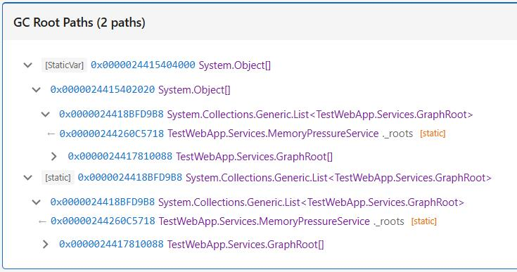
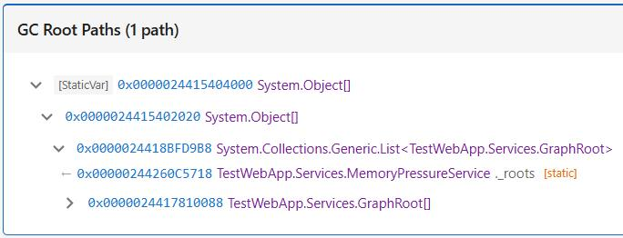

# DATAS Bug in .NET 10 — Static Field Root Enumeration

## Overview

Starting with .NET 10, the runtime's **DATAS** feature (_Dynamic Adaptation To Application Size_) breaks handle table enumeration in the DAC (Data Access Component), causing `GCRoot.EnumerateRootPaths()` to return **no results** in many cases. This affects all diagnostic tooling built on ClrMD, including SOS, PerfView, and PowerDiagnostics.

The bug was reported and tracked in [microsoft/clrmd#1474](https://github.com/microsoft/clrmd/issues/1474).

## Root Cause

1. **DATAS** dynamically reduces the number of GC heaps (e.g., from 8 down to 1 on an 8-core machine) to optimize memory usage for smaller workloads.

2. The .NET runtime allocates **one HandleTable per processor** (not per GC heap). Under normal operation, `GCHeapCount` equals the processor count, so enumerating `GCHeapCount()` HandleTables covers all handles.

3. When DATAS reduces the GC heap count, the DAC's handle table walking code still uses `GCHeapCount()` to calculate how many HandleTables to walk:

   ```
   max_slots = GCHeapCount();   // = 1 with DATAS, but there are 8 HandleTables
   ```

4. This means **7 out of 8 HandleTables are never walked**. Any static variable roots, `GCHandle.Alloc` handles, or other GC roots stored in those tables are invisible to `GCRoot`, `!gchandles`, and all dependent tooling.

### The Fix (in .NET 11)

The runtime fix is in `src/coreclr/debug/daccess/daccess.cpp` — it uses the **total number of HandleTables** instead of `GCHeapCount` when DATAS is active. This was committed for .NET 11 but [did not make it into .NET 10](https://github.com/dotnet/runtime/blob/980c9d17f4fcae8c2fd5dcf08bd4701b6925bc55/src/coreclr/debug/daccess/daccess.cpp#L7096-L7113).

## Two Workarounds

Since the runtime fix cannot be backported to .NET 10, two independent workarounds exist at the ClrMD level. Both work by tracing upward from static fields through `FindReferencing` when `GCRoot` returns empty results.

### 1. Microsoft.Diagnostics.Runtime (ClrMD PR #1477)

The ClrMD library itself [added a workaround (PR #1477)](https://github.com/microsoft/clrmd/pull/1477) that enumerates static and thread-static variables through an alternative mechanism. When building root paths, ClrMD's workaround **includes the two `object[]` parent containers** (`_roots` and `_arrays`) that the .NET runtime uses internally to hold static field values. These appear as intermediate nodes in the GC root chain:

```
[GC Root] → object[] (_roots) → List<GraphRoot> → … → target object
```

This workaround is automatic in newer builds of `Microsoft.Diagnostics.Runtime` (post-PR #1477).

### 2. PowerDiagnostics `ApplyNet10DatasStaticWorkaround`

PowerDiagnostics implements its own fallback in `DiagnosticAnalyzer.GetRootPaths()` (see `DiagnosticAnalyzer.Analysis.cs`). When `ApplyNet10DatasStaticWorkaround` is `true` and `EnumerateRootPaths()` returns nothing, the code calls `FindPathsToStatics()`, which:

1. Enumerates all static fields via `GetStaticFields()`.
2. For each static field, calls `GCRoot.FindPathFrom(root.obj)` to trace forward toward the target object.
3. Returns paths that **skip the `object[]` containers** and show the static field directly:

```
[Static: MemoryPressureService._roots (List<GraphRoot>)] → … → target object
```

| Property | ClrMD Workaround | PowerDiagnostics Workaround |
|---|---|---|
| Includes `object[]` containers | ✅ Yes | ❌ No (skipped) |
| Shows static field name | ❌ Indirect | ✅ Direct |
| Scope | All ClrMD consumers | DiagnosticServer only |
| Activation | Automatic (library update) | Opt-in via config |

### Visual Comparison

#### Both Workarounds Applied



Both workarounds applied simultaneously. ClrMD's workaround shows root paths through the `object[]` containers, while PowerDiagnostics' workaround shows additional paths directly from the static field root.

#### No PowerDiagnostics Workaround (Default)



Only ClrMD's workaround is active (`ApplyNet10DatasStaticWorkaround = false`, the default). The PowerDiagnostics direct static field paths are absent.

### Configuration

The PowerDiagnostics workaround is controlled via `AnalyzerSettings`:

```jsonc
// DiagnosticServer/appsettings.json
{
  "GeneralConfiguration": {
    "AnalyzerSettings": {
      "ApplyNet10DatasStaticWorkaround": false  // default
    }
  }
}
```

- **Default value**: `false` (workaround disabled)
- **Applies to**: `DiagnosticServer` only (set in `DebuggingSessionService.PrepareDiagnosticAnalyzer()`)
- **DiagnosticWPF**: Always uses the default (`false`) — no configuration override

When enabled, `GetRootPaths()` supplements the standard `GCRoot.EnumerateRootPaths()` output with paths traced from static fields:

```csharp
// DiagnosticAnalyzer.Analysis.cs (simplified)
if (ApplyNet10DatasStaticWorkaround)
{
    paths.AddRange(FindPathsToStatics(@object, Token)
        .Select(t => (Root: (ClrRoot?)null,
                      StaticField: (ClrStaticField?)t.Item1,
                      Path: t.Item2)));
}
```

## Remaining Limitations

Even with both workarounds active, the following remain unfixed until .NET 11:

- **Handle table enumeration is incomplete**: `GCHandle.Alloc` handles in the skipped HandleTables are invisible to ClrMD, SOS (`!gchandles`), and PerfView.
- **No workaround exists for missing handles**: Unlike static variables, there is no alternative path to discover GCHandles stored in the unwalked tables.

## Related Queries

The PowerDiagnostics query `GetStaticFieldsWithGraphAndSize` (`DiagnosticAnalyzer.Statics.cs`) shows **all** static fields including the container fields `_roots` and `_arrays` (which are `List<byte[]>` and `List<GraphRoot>` in the `MemoryPressureService` demo). These container fields are the same `object[]` arrays that appear as intermediate nodes in the ClrMD workaround paths.

## References

- [microsoft/clrmd#1474](https://github.com/microsoft/clrmd/issues/1474) — Bug report and investigation
- [microsoft/clrmd#1477](https://github.com/microsoft/clrmd/pull/1477) — ClrMD fix for static/thread-static walking
- [dotnet/runtime daccess.cpp fix](https://github.com/dotnet/runtime/blob/980c9d17f4fcae8c2fd5dcf08bd4701b6925bc55/src/coreclr/debug/daccess/daccess.cpp#L7096-L7113) — Runtime-level fix (.NET 11 only)
